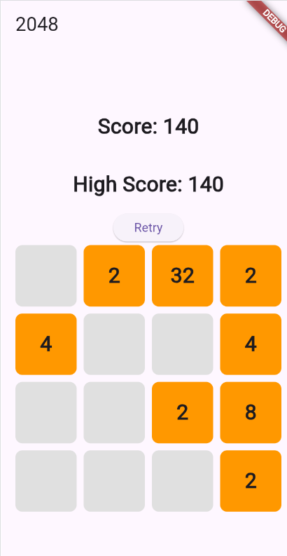

# 2048 Game

A simple 2048 game implemented using Flutter. This game supports touch gestures for mobile devices and keyboard input for web and desktop applications.

## Features

- Swipe to move tiles (left, right, up, down)
- Combine tiles with the same number to merge them and increase the score
- Randomly generates new tiles (2 or 4) after each move
- Keeps track of the current score and the highest score
- Retry button to reset the game

## Getting Started

### Prerequisites

- [Flutter SDK](https://flutter.dev/docs/get-started/install)
- A code editor like [Visual Studio Code](https://code.visualstudio.com/) or [Android Studio](https://developer.android.com/studio)

### Installation

1. Clone the repository:
    ```sh
    git clone https://github.com/yourusername/2048-flutter.git
    ```
2. Navigate to the project directory:
    ```sh
    cd 2048-flutter
    ```
3. Get the required dependencies:
    ```sh
    flutter pub get
    ```

### Running the App

#### Mobile (iOS/Android)

1. Connect your mobile device or start an emulator.
2. Run the app:
    ```sh
    flutter run
    ```

#### Web

1. Ensure you have the required tools for web development:
    ```sh
    flutter config --enable-web
    flutter doctor
    ```
2. Run the app in your browser:
    ```sh
    flutter run -d chrome
    ```

#### Desktop (Windows/macOS/Linux)

1. Ensure you have the required tools for desktop development:
    ```sh
    flutter config --enable-macos-desktop
    flutter doctor
    ```
2. Run the app on your desktop:
    ```sh
    flutter run -d macos
    ```

## How to Play

- Use swipe gestures (left, right, up, down) on mobile devices to move the tiles.
- Use arrow keys (←, →, ↑, ↓) on web and desktop applications to move the tiles.
- When two tiles with the same number touch, they merge into one.
- The goal is to create a tile with the number 2048.

## Screenshot



## License

This project is licensed under the MIT License - see the [LICENSE](LICENSE) file for details.
